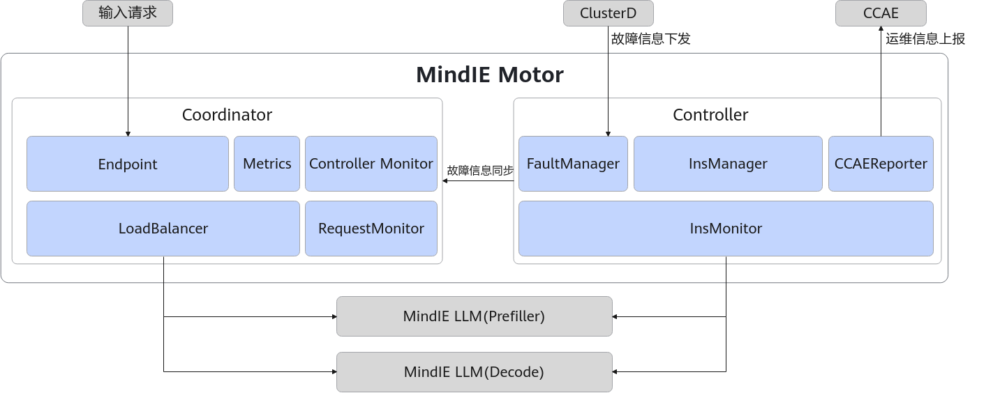

# MindIE Motor

## 🔥Latest News

[2025/12] MindIE Motor正式开源。

## 🚀简介

MindIE Motor是面向通用模型场景的推理服务化框架，通过开放、可扩展的推理服务化平台架构提供推理服务化能力，支持对接业界主流推理框架接口，满足大语言模型的高性能推理需求。

MindIE Motor的组件包括MindIE Service Tools、集群管理组件（Controller和Coordinator），通过对接昇腾推理加速引擎带来大模型在昇腾环境中的性能提升，并逐渐以高性能和易用性牵引用户向MindIE原生推理服务化框架迁移。其架构图如[图1 MindIE-Motor架构图](#fig186975591945)所示。

**图 1** MindIE Motor架构图  

**MindIE Motor 是面向通用模型场景的推理服务化框架，通过开放、可扩展的推理服务化平台架构提供推理服务化能力，支持对接业界主流推理框架接口，满足大语言模型的高性能推理需求**。

以下是两个 MindIE-Motor 代码仓库**智能体**，只需点击 "**Ask AI**" 徽章，即可进入其专属页面，有效缓解源码阅读的困难，开启智能代码学习与问答体验！它们将帮助您更深入地理解 MindIE-Motor 的运行原理，并协助解决使用过程中遇到的问题与错误。

[![Zread](https://img.shields.io/badge/Zread-Ask_AI-_.svg?style=flat&color=0052D9&labelColor=000000&logo=data%3Aimage%2Fsvg%2Bxml%3Bbase64%2CPHN2ZyB3aWR0aD0iMTYiIGhlaWdodD0iMTYiIHZpZXdCb3g9IjAgMCAxNiAxNiIgZmlsbD0ibm9uZSIgeG1sbnM9Imh0dHA6Ly93d3cudzMub3JnLzIwMDAvc3ZnIj4KPHBhdGggZD0iTTQuOTYxNTYgMS42MDAxSDIuMjQxNTZDMS44ODgxIDEuNjAwMSAxLjYwMTU2IDEuODg2NjQgMS42MDE1NiAyLjI0MDFWNC45NjAxQzEuNjAxNTYgNS4zMTM1NiAxLjg4ODEgNS42MDAxIDIuMjQxNTYgNS42MDAxSDQuOTYxNTZDNS4zMTUwMiA1LjYwMDEgNS42MDE1NiA1LjMxMzU2IDUuNjAxNTYgNC45NjAxVjIuMjQwMUM1LjYwMTU2IDEuODg2NjQgNS4zMTUwMiAxLjYwMDEgNC45NjE1NiAxLjYwMDFaIiBmaWxsPSIjZmZmIi8%2BCjxwYXRoIGQ9Ik00Ljk2MTU2IDEwLjM5OTlIMi4yNDE1NkMxLjg4ODEgMTAuMzk5OSAxLjYwMTU2IDEwLjY4NjQgMS42MDE1NiAxMS4wMzk5VjEzLjc1OTlDMS42MDE1NiAxNC4xMTM0IDEuODg4MSAxNC4zOTk5IDIuMjQxNTYgMTQuMzk5OUg0Ljk2MTU2QzUuMzE1MDIgMTQuMzk5OSA1LjYwMTU2IDE0LjExMzQgNS42MDE1NiAxMy43NTk5VjExLjAzOTlDNS42MDE1NiAxMC42ODY0IDUuMzE1MDIgMTAuMzk5OSA0Ljk2MTU2IDEwLjM5OTlaIiBmaWxsPSIjZmZmIi8%2BCjxwYXRoIGQ9Ik0xMy43NTg0IDEuNjAwMUgxMS4wMzg0QzEwLjY4NSAxLjYwMDEgMTAuMzk4NCAxLjg4NjY0IDEwLjM5ODQgMi4yNDAxVjQuOTYwMUMxMC4zOTg0IDUuMzEzNTYgMTAuNjg1IDUuNjAwMSAxMS4wMzg0IDUuNjAwMUgxMy43NTg0QzE0LjExMTkgNS42MDAxIDE0LjM5ODQgNS4zMTM1NiAxNC4zOTg0IDQuOTYwMVYyLjI0MDFDMTQuMzk4NCAxLjg4NjY0IDE0LjExMTkgMS42MDAxIDEzLjc1ODQgMS42MDAxWiIgZmlsbD0iI2ZmZiIvPgo8cGF0aCBkPSJNNCAxMkwxMiA0TDQgMTJaIiBmaWxsPSIjZmZmIi8%2BCjxwYXRoIGQ9Ik00IDEyTDEyIDQiIHN0cm9rZT0iI2ZmZiIgc3Ryb2tlLXdpZHRoPSIxLjUiIHN0cm9rZS1saW5lY2FwPSJyb3VuZCIvPgo8L3N2Zz4K&logoColor=ffffff)](https://zread.ai/verylucky01/MindIE-Motor)&nbsp;&nbsp;&nbsp;&nbsp;
[![DeepWiki](https://img.shields.io/badge/DeepWiki-Ask_AI-_.svg?style=flat&color=0052D9&labelColor=000000&logo=data:image/png;base64,iVBORw0KGgoAAAANSUhEUgAAACwAAAAyCAYAAAAnWDnqAAAAAXNSR0IArs4c6QAAA05JREFUaEPtmUtyEzEQhtWTQyQLHNak2AB7ZnyXZMEjXMGeK/AIi+QuHrMnbChYY7MIh8g01fJoopFb0uhhEqqcbWTp06/uv1saEDv4O3n3dV60RfP947Mm9/SQc0ICFQgzfc4CYZoTPAswgSJCCUJUnAAoRHOAUOcATwbmVLWdGoH//PB8mnKqScAhsD0kYP3j/Yt5LPQe2KvcXmGvRHcDnpxfL2zOYJ1mFwrryWTz0advv1Ut4CJgf5uhDuDj5eUcAUoahrdY/56ebRWeraTjMt/00Sh3UDtjgHtQNHwcRGOC98BJEAEymycmYcWwOprTgcB6VZ5JK5TAJ+fXGLBm3FDAmn6oPPjR4rKCAoJCal2eAiQp2x0vxTPB3ALO2CRkwmDy5WohzBDwSEFKRwPbknEggCPB/imwrycgxX2NzoMCHhPkDwqYMr9tRcP5qNrMZHkVnOjRMWwLCcr8ohBVb1OMjxLwGCvjTikrsBOiA6fNyCrm8V1rP93iVPpwaE+gO0SsWmPiXB+jikdf6SizrT5qKasx5j8ABbHpFTx+vFXp9EnYQmLx02h1QTTrl6eDqxLnGjporxl3NL3agEvXdT0WmEost648sQOYAeJS9Q7bfUVoMGnjo4AZdUMQku50McDcMWcBPvr0SzbTAFDfvJqwLzgxwATnCgnp4wDl6Aa+Ax283gghmj+vj7feE2KBBRMW3FzOpLOADl0Isb5587h/U4gGvkt5v60Z1VLG8BhYjbzRwyQZemwAd6cCR5/XFWLYZRIMpX39AR0tjaGGiGzLVyhse5C9RKC6ai42ppWPKiBagOvaYk8lO7DajerabOZP46Lby5wKjw1HCRx7p9sVMOWGzb/vA1hwiWc6jm3MvQDTogQkiqIhJV0nBQBTU+3okKCFDy9WwferkHjtxib7t3xIUQtHxnIwtx4mpg26/HfwVNVDb4oI9RHmx5WGelRVlrtiw43zboCLaxv46AZeB3IlTkwouebTr1y2NjSpHz68WNFjHvupy3q8TFn3Hos2IAk4Ju5dCo8B3wP7VPr/FGaKiG+T+v+TQqIrOqMTL1VdWV1DdmcbO8KXBz6esmYWYKPwDL5b5FA1a0hwapHiom0r/cKaoqr+27/XcrS5UwSMbQAAAABJRU5ErkJggg==)](https://deepwiki.com/verylucky01/MindIE-Motor)

MindIE Motor 的组件包括：

-   MindIE LLM：提供大模型推理能力，同时提供多并发请求的调度功能。

## 🔍目录结构

*待开发补充*

## ⚡️版本说明

|MindIE软件版本|CANN版本兼容性|
|:---|:---|
|2.2.RC1|8.3.RC2|

## ⚡️环境部署

MindIE Motor安装前的相关软硬件环境准备，以及安装步骤，请参见[安装指南](./docs/zh/User_Guide/installation_guide.md)。

## ⚡️快速入门

  快速体验启动服务、接口调用、精度&性能测试和停止服务全流程，请参见[快速入门](./docs/zh/User_Guide/quick_start.md)。

## 📝学习文档

- [集群服务部署](./docs/zh/user_guide/service_deployment/)：介绍MindIE Motor集群服务部署方式，包括单机（非分布式）服务部署和PD分离单、多机服务部署。
- [集群管理组件](./docs/zh/user_guide/cluster_management_component/)：介绍MindIE Motor集群管理组件，包括Controller和Coordinator。
- [服务化接口](./docs/zh/user_guide/service_oriented_interface/)：介绍MindIE Motor提供的用户侧接口和集群内通信接口。
- [配套工具](./docs/zh/user_guide/service_oriented_optimization_tool.md)：介绍MindIE Motor提供的配套工具，包括性能/精度测试工具、MindIE探针工具、服务化调优工具、CertTools、OM Adapter和Node Manager。

## 📝免责声明

版权所有© 2025 MindIE Project.

您对"本文档"的复制、使用、修改及分发受知识共享（Creative Commmons）署名——相同方式共享4.0国际公共许可协议（以下简称"CC BY-SA 4.0"）的约束。为了方便用户理解，您可以通过访问https://creativecommons.org/licenses/by-sa/4.0/了解CC BY-SA 4.0的概要（但不是替代）。CC BY-SA 4.0的完整协议内容您可以访问如下网址获取：https://creativecommons.org/licenses/by-sa/4.0/legalcode。

## 📝贡献指南

1. 提交错误报错：如果您在MindIE Motor中发现了一个不存在安全问题的漏洞，请在MindIE Motor仓库中的Issues中搜索，以防该漏洞被重复提交，如果找不到漏洞可以创建一个新的Issues。如果发现了一个安全问题请不要将其公开，请参阅安全问题处理方式。提交错误报告时应该包含完整信息。
2. 安全问题处理：本项目中对安全问题处理的形式，请通过邮箱通知项目核心人员确认编辑。
3. 解决现有问题：通过查看仓库的Issues列表可以发现需要处理的问题信息，可以尝试解决其中的某个问题。
4. 如何提供新功能：请使用Issues的Feature标签进行标记，我们会定期处理和确认开发。
5. 开始贡献：
   1. Fork本项目的仓库。
   2. Clone到本地。
   3. 创建开发分支。
   4. 本地测试：提交前请通过所有单元测试，包括新增的测试用例。
   5. 提交代码。
   6. 新建Pull Request。
   7. 代码检视：您需要根据评审意见修改代码，并重新提交更新。此流程可能涉及多轮迭代。
   8. 当您的PR获得足够数量的检视者批准后，Committer会进行最终审核。
   9. 审核和测试通过后，CI会将您的PR合并到项目的主干分支。
 
更多贡献相关文档请参见[贡献指南](./contributing.md)。

## 📝相关信息

- [安全声明](./security.md)
- [LICENSE](./LICENSE.md)
